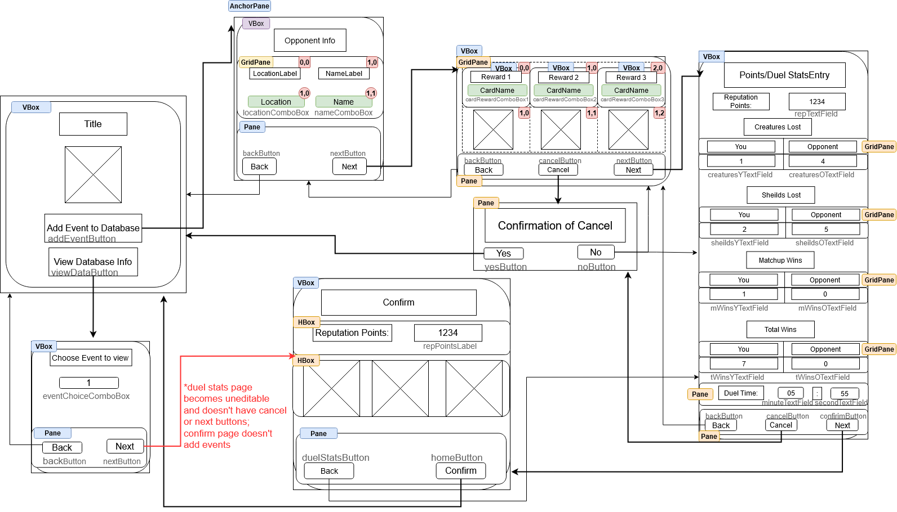

# Unit Deliverable 2 - Final Project GUI

## Project Explanation/Scene walkthrough

Again, the purpose of the final project will be to fill out a database of card rewards in the Duel Masters PS2 video game.
Therefore, I've set up the UI to follow through the order in which you recieve each piece of information to fill out the
data for a specific event. (A battle of the card game which gives card rewards and reputation point rewards for winning)
Most of the functionality is not yet implemented, with the exception of the card reward input screen.

The first scence has an image of the PS2 game's logo, and buttons to choose whether to add a new event or view the events currently in the database. These are the two main branches you can go through.

### Adding Events

Clicking the Add Events button creates a popup which will go through the process of adding information for each reward event.
#### Opponent Input
The first scene is for the information of the opponent you battle. It lets you choose (through combo boxes which have only valid options) the location and the name of the opponent you will battle.
You can hit the back button to close the window, (The initial window was left open, so you can get back to it immediately), or the next button to proceed to the next scene.
In the final project, the boxes will be filled out, and hitting the next button will check to make sure you have a valid combination of name and location. If it doesn't you stay on the screen to fix it, and if it does, It will save the information of the opponent portion of the reward event and send you to the next scene.
#### Card Reward Input
The next scene is for Card reward input. This scene is the one that actually has most of its funtionality; It was the best place to implement the DMCard model class I made for UD1 and doing so helped me figure out what specifically I would need out of the CardLink class I had planned for the final project. 

This screen has 3 combo boxes of DMCards, 1 for each card that you get as a reward. This means the user can select the card they got from a dropdown, but because the game has about 140 cards, it's set up that you can type in the box, and it will automatically select the first card that matches what you've typed so far. This means you only have to type up to the first unique character in a card's name, rather than type the whole thing out our scroll through a huge dropdown list each time.
An image of the card's art is also brought up whenever a card is selected, for visual feedback that you can make sure matches the the game. Pressing enter will automatically select based on the current text entry, and if it was valid, will bring you to the next box. An invalid entry keeps you on the current box, and prints "Misspelling" to the console. This will be changed to give direct user feedback in the future. The boxes at this point only have 3 cards as a proof of concept, but will have all cards available in-game as options in the final project.

The back button takes you back to the Opponent Input scene (same window). In the final project, it will repopulate each field with the data the was there initially.

The new cancel button brings up a popup asking if the user would like to cancel adding this event. If they click "No," then the popup closes, sending them back to this screen. If they click yes, the popup closes itself and this window, bringing them back to the initial scene's window and discarding all information of this event.

The next button moves onto the Stats Input scene. In the final project, this will again check to make sure all card selections are valid and then add the card information to the reward event and send it to the next scene if so.
#### Stats input
The next thing the player of the Duel Masters game sees when they win, after the cards, is the Reputation Points won from the duel. Because this is only a single item, it has been combined with the input of the information from the Duel Stats screen shown next in-game.
There are text fields for Reputation Points, Creatures Lost (player and opponent), Shields Lost (player and opponent), Matchup Wins (player and opponent, tracks wins/losses of the player versus this specific opponent), Total Wins (player and opponent, tracks wins/losses of the player overall), and Duel Time (One field for minutes, another for seconds). All of these fields are Integer-only, and if non-integer values are inputted the fields reset.

This has similar back and cancel buttons to the Rewards Input scene, and the next button brings you to the Confirm scene. In the final project, it will add the stats input data to the reward event and send it onwards
#### Confirm
This scene shows the 3 cards chosen and the reputation points gained, and is a last chance for the user to make changes to this event. It has a Back button to go to the stats input screen, and a confirm button which closes the window, sending the user back to the intial scene's window. In the final project, this is where the reward event would be added to the database and then saved.

### Viewing Events

The other main branch the user can go through, also as a popup from the initial scene. The first scene of this branch has a combo box. In the final project, it will have all of the reward events that have been added to the database. They can hit the back button to close the window, returning to the initial scene, or the next button to view the information of the selected event. 

The next button takes the user to a version of the Confirm scene from add events, but it takes the information that the usere is not adding an event to change the text of the buttons to match the current status. In the final project, hitting the confirm button (now reading "Return to Home") from this version of the Confirms scene will NOT add the event to the database.
Hitting the DuelStatsButton (now reading "See Event Stats" instead of next) will take the user to a modified version of the Duel Stats page, tell it that it's not adding an event, and in the final project, give it the information of this reward event.

The view version of the duel stats page has all fields become uneditable, and in the final project will fill in the information from the event the user is viewing.
The buttons to return to the card input screen and to cancel adding the event are hidden, so the user only has the option to return to the view version of the confirm screen.

## GUI Wireframe

